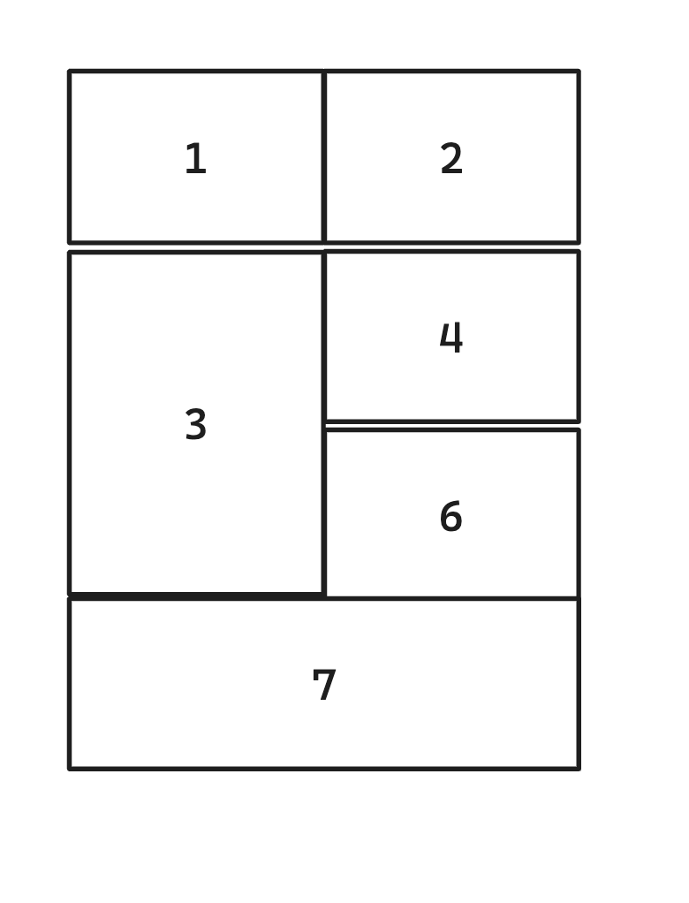

# Simulacro examen UT1 : Lenguajes de marcas

## 1. XML

En el fichero `persona.xml`, pasar la estructura de la siguiente imagen a XML teniendo en cuenta:
1. Nombres de propiedades [1pt]
2. Propiedades compuestas [1pt]
3. Listas [1pt]

## 2.HTML

Partiendo del fichero `index.html`:

1. Cambia el nombre de la pestaña del navegador a "Simulacro" [1pt]
2. Añade un encabezado o título (el más importante): `UT1: LLMM (Simulacro)` [0.5pt]
3. Añade párrafo con: `Esto es un simulacro de un examen` [0.5pt]
4. Crea una lista desordenada con 3 elementos [1pt]
5. Una tabla[2pt]

## 3.CSS
Vincula el fichero `style.css` y haz lo siguiente:
1. El encabezado del index.html tiene que tener: [1pt]
    - 64px de tamaño de fuente
    - fuente Arial
    - color: #6741d9

2. Las celdas 4 y 7 de la tabla: [1pt]
    - color de fondo: d0bfff

